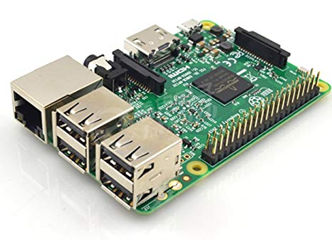
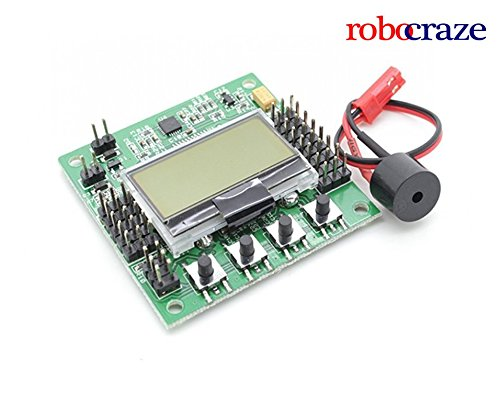

# Flight-Controller-KK-2.1.5-Using-Raspberry-pi-3

This is a repository about how you can  Controll KK 2.1.5 flght Controller by using the Rapsberry pi 3.  

# Raspberry pi3  
  
Raspberry pi pin no. [21, 22, 26, 27] work as a pulse width mudulation so you can use this pins to give signal to the flight controller.
In this type of controlling your raspberry pi generate a signal which is similer to the Radio Transmitter and feed the signal to the Flight Controller which is similer to the reciver.  
  
### required packages
1. getch
2. pigpio (most of the time this package already available in raspberry pi)

   

Basically Flight Controller work on the PWM signal which is feed by the raspberry pi 3. 
set the pins according to your configuration and connect them to the Flight Controller 
### ALE == 27
### ELE == 22
### THR == 26
### RUD == 21
